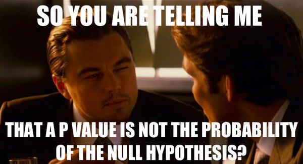

<!-- # Bayesian, huh? {background-image="resources/images/better-git-it.png" background-size="50%" background-position="bottom right"} -->

# Bayesian, huh? {background-image="resources/images/vince.gif" background-size="50%" background-position="bottom right"}

## primer: science before statistics


```{r}

```

. . .

- doing statistical modelling requires a **scientific model** and knowledge about how the data were collected

. . .

- the reason for doing statistics and the design of a statistical model cannot be found in or extracted from the observed data


<div style="font-size: 0.3em; position: absolute; bottom: 0; right: 0;">
@mcelreath2020; @gould2025
</div>

## Bayesian in nutshell

- update our state of knowledge using observed data

$$
\overbrace{p(\theta \mid \textrm{data})}^{\text{Posterior}} =
\frac{\overbrace{p(\textrm{data} \mid \theta)}^{\text{Likelihood}} \times \overbrace{p(\theta)}^{\text{Prior}}}
{\underbrace{p(\textrm{data})}_{\text{(Normalizing constant)}}}
$$

. . .

::: {style="font-size: 0.8em"}
- $\theta$ is short for the set of parameters we estimate (e.g. intercept, slope(s), correlations, dispersion, variance)
- we ignore the denominator - it's foremost and "only" a normalizing constant...
:::


## Bayesian vs. frequentist

::: {.incremental}

- the key difference, philosophical speaking, between frequentist and Bayesian approaches is:

  - frequentist: parameters are fixed, data vary ("if I repeated this experiment indefinetly")
  
    - $p(\text{data}|\theta)$
  
  - Bayesian: parameters vary (they are variables with distributions), data are fixed
  
    - $p(\theta|\text{data})$

- a lot of the machinery is the same!!!

:::

## frequentist **confidence interval**

:::{.columns}

::: {.column width="70%" .incremental}
> if we were to repeatedly take many(!) random samples about X% of those computed intervals would contain the true parameter
:::

::: {.column width="30%"}

```{r, fig.align='right', out.width='100%'}

```

:::
:::

. . .

- for a specific interval we cannot say there is a X% probability that it contains the parameter value  

. . .

- there is no distributional quality to a CI

. . .

- the parameter value is a single value, a point estimate


## Bayesian **credible interval**


> given the observed data, there is a X% probability that the true parameter lies within the computed interval


. . .

- isn't this nice?

. . .

- the estimated parameter is a distribution

## distributions vs point estimates


::: {style="font-size: 0.8em" .fragment fragment-index=1}
<!-- - a bullet point (index = 3) -->
:::

:::{.columns}

::: {.column width="50%" .fragment fragment-index=1}
::: {style="font-size: 0.4em" .fragment fragment-index=1}
```{r, fig.width=4, fig.height=2.3}
plot(0, 0, "n", xlim = c(0, 1), ylim = c(0, 3), yaxs = "i", xlab = "estimated proportion", ylab = "density", xaxs = "i", axes = FALSE)
axis(1)

xvals <- seq(0, 1, length.out = 101)
polygon(c(rev(xvals), xvals), c(rep(0, length(xvals)), dbeta(x = xvals, 7, 4)), col = "darkblue")
# dbeta(x = xvals, 7, 4) is post when prior is flat (beta(1, 1)) 7 = 6+1, 4 = 3+1
# polygon(c(rev(xvals), xvals), c(rep(0, length(xvals)), dbeta(x = xvals, 1, 1)), col = "darkred")
```
:::
::: {style="font-size: 0.8em" .fragment fragment-index=1}
Bayesian posterior **distribution**
:::
:::

::: {.column width="50%" .fragment fragment-index=2}


::: {style="font-size: 0.4em" .fragment fragment-index=1}


```{r, fig.width=4, fig.height=2.3}
heads <- 6
flips <- 9
theta_hat <- heads / flips

se <- sqrt(theta_hat * (1 - theta_hat) / flips)
ci_lower <- theta_hat - 1.96 * se
ci_upper <- theta_hat + 1.96 * se

plot(0, 0, "n", xlim = c(0, 1), ylim = c(0, 3), yaxs = "i", xlab = "estimated proportion", ylab = "", xaxs = "i", axes = FALSE)
segments(x0 = ci_lower, y0 = 1.5, x1 = ci_upper, y1 = 1.5, lwd = 2, col = "darkblue")
points(6 / 9, 1.5, pch = 21, bg = "darkblue", cex = 2.2)
axis(1)
```

:::


::: {style="font-size: 0.8em" .fragment fragment-index=2}
frequentist **point estimate** with confidence interval
:::


:::

:::

::: {style="font-size: 1em" .fragment fragment-index=1}
<!-- - a last point (index = 1) -->
:::


## how do we estimate things?

::: {style="font-size: 0.9em" .incremental}

- it's about estimating parameters, not about formal hypothesis testing

- if we just test silly null hypotheses with `brms` instead of `lme4` we have gained nothing...

- maximum likelihood vs. obtaining posterior distributions

- ML: `lme4`, `glmmTMB`

- Bayesian: Stan 
  - formula syntax R interfaces: `brms`, `rstanarm`, (`rethinking`)
  - interact with Stan directly from R: `cmdstanr`, `rstan`

- (also PyMC3, Julia, BUGS, JAGS, JAX, ...)
:::


# workflow {background-image="resources/images/fence.png" background-size="50%" background-position="bottom right"}

## key components (a selection)

- prior predictive checks

- posterior predictive checks

- (prior elicitation)

- (model comparison)

- (sensitivity analysis)

- (simulation-based calibration)

- (hypothesis testing)

::: {.notes}
as with frequentist approaches, a lot of these checks require subjective judgments
:::

## prior predictive checks
:::{.incremental}
- understand implications of priors through simulation  
  - simulate data from prior distribution(s)
  - do resulting data look plausible
- there are no *correct* priors, only scientifically justifiable priors
- simulate, understand
:::

<div style="font-size: 0.3em; position: absolute; bottom: 0; right: 0;">@mcelreath2020; @vandeschoot2021</div>


## posterior predictive checks
:::{.incremental}
> If a model is a good fit we should be able to use it to generate data that resemble the data that we observed.

- use actual posteriors to generate new response values
- compare features of the simulated responses to observed 
  - distribution shape
  - summary statistic

:::

<div style="font-size: 0.3em; position: absolute; bottom: 0; right: 0;">@gabry2019</div>
