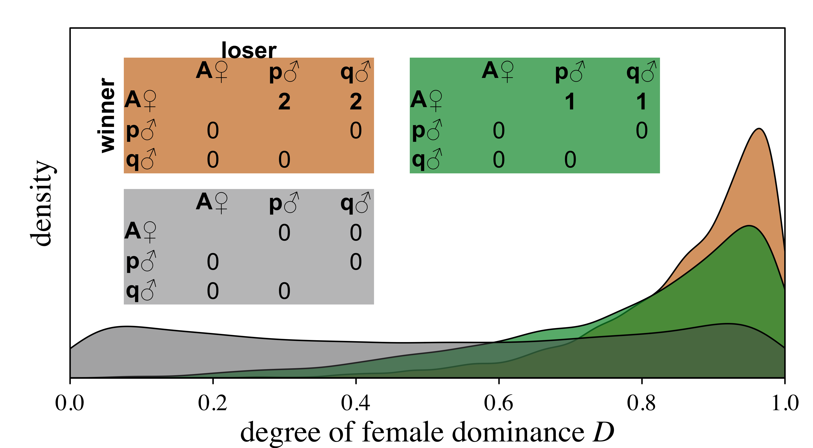

# showcases {background-image="resources/images/hundeklo.png" background-size="60%" background-position="bottom right"}

## do we need Bayes for everything?

- ~~yes~~no[^strt]

. . .

- we don't need a chainsaw to cut the birthday cake

. . .

- but there are a lot of trees that need cutting


[^strt]: but it wouldn't hurt

## where do Bayesian models really shine?

:::{.columns}

::: {.column width="60%"  .fragment }

::: {style="font-size: 0.8em"}

- analysis for network data (multimembership models, SRM)
- propagating uncertainty
- measurement error models
- misclassification
- non-linear models
- latent variables
- custom models aka full Bayesian luxury
- ...

:::
:::


::: {.column width="40%"}

```{r, fig.align='center'}

```

:::
:::


## analysing interaction data (aka network analysis)

```{r bamosofig, results='hide', fig.width=10, fig.height=5, fig.align='center', out.width="75%", fig.dpi=600}
# helper functions for schematic

rrect <- function(x1, y1, x2, y2, r, ...) {
  # col = par()$col, border, lwd = 1
  theta <- seq(0, pi/2, length.out = 21)
  
  xvals <- c(x1 + r - r*cos(theta),
             rev(x2 - r + r*cos(theta)),
             x2 - r + r*cos(theta),
             rev(x1 + r - r*cos(theta)))
  yvals <- c(y2 - r + r*sin(theta),
             rev(y2 - r + r*sin(theta)),
             y1 + r - r*sin(theta),
             rev(y1 + r - r*sin(theta)))
  
  # polygon(xvals, yvals, border = border, lwd = lwd, col = col)
  polygon(xvals, yvals, ...)
  
}

squeeze <- function(x, lims, fac = 0.1) {
  dlims <- diff(lims)
  lims[1] <- lims[1] + dlims * fac
  lims[2] <- lims[2] - dlims * fac
  min(lims) + (x - min(x)) * (max(lims) - min(lims)) / (max(x) - min(x))
}

draw_circle <- function(coords, rad, ...) {
  xvals <- coords[1] + rad * cos(seq(0, 2*pi , length.out = 51))
  yvals <- coords[2] + rad * sin(seq(0, 2*pi , length.out = 51))
  polygon(xvals, yvals, ...)
}


# dopdf <- TRUE

# quartz(width = 10, height = 5)
# if (dopdf)  pdf("summaryschemefig.pdf", width = 10, height = 5)
# pdf("summaryschemefig2.pdf", width = 10, height = 5)
par(mar = c(.2, 1, .1, .1))
# par(mar = c(2, 2, 1, 1))
par(family = "serif")
plot(0, 0, xlim = c(0, 100), ylim = c(0, 50), type = "n", asp = 1, axes = FALSE)
xleft <- c(-5, 35)
yleft <- c(5, 40)


text(mean(xleft), 49, "observable", cex = 1.8, adj = c(0.5, 0), font = 2)
text(75, 49, "unobservable", cex = 1.8, adj = c(0.5, 0), font = 2)

xtopright <- xbotright <- c(50, 103)
ytopright <- c(28, 48)
ybotright <- c(2, 22)

A <- c(xleft = 52, xright = 72, ybot = 3, ytop = 21)
B <- c(xleft = 78, xright = 98, ybot = 3, ytop = 21)
C <- c(xleft = A[1], xright = A[2], ybot = 29, ytop = 47)
D <- c(xleft = B[1], xright = B[2], ybot = 29, ytop = 47)

textfac <- 1.37
text(mean(xleft), yleft[2] * 1.07, labels = 'observed interactions', cex = textfac)
text(mean(A[1:2]), mean(c(A[3], C[4])), labels = 'individual\ngregariousness', cex = textfac)
text(mean(B[1:2]), mean(c(A[3], C[4])), labels = 'dyadic\naffinity', cex = textfac)

textfac <- 1.2
text(mean(c(B[2], xtopright[2])), C[4], labels = "(a)", adj = c(0.5, 1))
text(mean(c(B[2], xtopright[2])), B[3], labels = "(b)", adj = c(0.5, 0))


points(75, mean(ytopright), pch = "+", cex = 3)
points(75, mean(ybotright), pch = "+", cex = 3)


rrect(x1 = xleft[1], y1 = yleft[1], x2 = xleft[2], y2 = yleft[2], r = 1, border = grey(0.8), col = NA, xpd = T)
# rrect(x1 = xleft[1], y1 = yleft[1], x2 = xleft[2], y2 = yleft[2], r = 1, border = NA, col = grey(0.8), xpd = T)


rrect(x1 = xtopright[1], y1 = ytopright[1], x2 = xtopright[2], y2 = ytopright[2], r = 1, border = grey(0.3), lwd = 0.3, col = NA)
rrect(x1 = xbotright[1], y1 = ybotright[1], x2 = xbotright[2], y2 = ybotright[2], r = 1, border = grey(0.3), lwd = 0.3, col = NA)

# rrect(C[1], C[3], C[2], C[4], r = 1, border = NA, col = grey(0.8))
# rrect(D[1], D[3], D[2], D[4], r = 1, border = NA, col = grey(0.8))
# rrect(A[1], A[3], A[2], A[4], r = 1, border = NA, col = grey(0.8))
# rrect(B[1], B[3], B[2], B[4], r = 1, border = NA, col = grey(0.8))
rrect(C[1], C[3], C[2], C[4], r = 1, border = grey(0.8), col = NA)
rrect(D[1], D[3], D[2], D[4], r = 1, border = grey(0.8), col = NA)
rrect(A[1], A[3], A[2], A[4], r = 1, border = grey(0.8), col = NA)
rrect(B[1], B[3], B[2], B[4], r = 1, border = grey(0.8), col = NA)

shape::Arrows(x0 = xleft[2] * 1.15, y0 = 32, x1 = xtopright[1] * 0.95, y1 = mean(ytopright), code = 1, arr.type = "triangle",
              arr.lwd = 1, lwd = 15, segment = T, lend = 1, arr.width = 1, arr.length = 1.2, arr.adj = 0.5)

shape::Arrows(x0 = xleft[2] * 1.15, y0 = 17, x1 = xtopright[1] * 0.95, y1 = mean(ybotright), code = 1, arr.type = "triangle",
              arr.lwd = 1, lwd = 15, segment = T, lend = 1, arr.width = 1, arr.length = 1.2, arr.adj = 0.5)


# top nets ----
n_sides <- 5
x <- (mean(C[c(1, 2)]) + (mean(C[c(1, 2)])/2) * cos(seq(pi/2, 2*pi + pi/2, length.out = n_sides + 1)))[1:n_sides]
y <- (mean(C[c(3, 4)]) + mean(C[c(3, 4)])/2 * sin(seq(pi/2, 2*pi + pi/2, length.out = n_sides + 1)))[1:n_sides]
round(lmat <- cbind(x, y), 2)
rownames(lmat) <- LETTERS[1:5]
lmat[, 1] <- squeeze(lmat[, 1], C[c(1, 2)], fac = 0.2)
lmat[, 2] <- squeeze(lmat[, 2], C[c(3, 4)], fac = 0.2)

rads <- c(2.5, 1.5, 3, 1.2, 0.8)
sapply(1:5, function(x){
  draw_circle(lmat[x, ], rad = rads[x], col = 'white', lwd = 0.5)
})
text(lmat[, 1], lmat[, 2], rownames(lmat), cex = 0.7)

n_sides <- 5
x <- (mean(D[c(1, 2)]) + (mean(D[c(1, 2)])/2) * cos(seq(pi/2, 2*pi + pi/2, length.out = n_sides + 1)))[1:n_sides]
y <- (mean(D[c(3, 4)]) + mean(D[c(3, 4)])/2 * sin(seq(pi/2, 2*pi + pi/2, length.out = n_sides + 1)))[1:n_sides]
round(lmat <- cbind(x, y), 2)
rownames(lmat) <- LETTERS[1:5]
lmat[, 1] <- squeeze(lmat[, 1], D[c(1, 2)], fac = 0.1)
lmat[, 2] <- squeeze(lmat[, 2], D[c(3, 4)], fac = 0.1)

fac = 0.5
points(lmat[c("A", "B"), ], lwd = 1*fac, type = "l")
points(lmat[c("A", "C"), ], lwd = 1*fac, type = "l")
points(lmat[c("A", "D"), ], lwd = 1*fac, type = "l")
points(lmat[c("A", "E"), ], lwd = 1*fac, type = "l")
points(lmat[c("B", "C"), ], lwd = 1*fac, type = "l")
points(lmat[c("B", "D"), ], lwd = 1*fac, type = "l")
points(lmat[c("B", "E"), ], lwd = 1*fac, type = "l")
points(lmat[c("C", "D"), ], lwd = 1*fac, type = "l")
points(lmat[c("C", "E"), ], lwd = 1*fac, type = "l")
points(lmat[c("D", "E"), ], lwd = 1*fac, type = "l")


sapply(1:5, function(x){
  draw_circle(lmat[x, ], rad = 1.5, col = grey(0.8), border = NA)
})


# bot nets ----
n_sides <- 5
x <- (mean(A[c(1, 2)]) + (mean(A[c(1, 2)])/2) * cos(seq(pi/2, 2*pi + pi/2, length.out = n_sides + 1)))[1:n_sides]
y <- (mean(A[c(3, 4)]) + mean(A[c(3, 4)])/2 * sin(seq(pi/2, 2*pi + pi/2, length.out = n_sides + 1)))[1:n_sides]
round(lmat <- cbind(x, y), 2)
rownames(lmat) <- LETTERS[1:5]
lmat[, 1] <- squeeze(lmat[, 1], A[c(1, 2)], fac = 0.2)
lmat[, 2] <- squeeze(lmat[, 2], A[c(3, 4)], fac = 0.2)

sapply(1:5, function(x){
  draw_circle(lmat[x, ], rad = 1.5, col = 'white', lwd = 0.5)
})
text(lmat[, 1], lmat[, 2], rownames(lmat), cex = 0.7)


n_sides <- 5
x <- (mean(B[c(1, 2)]) + (mean(B[c(1, 2)])/2) * cos(seq(pi/2, 2*pi + pi/2, length.out = n_sides + 1)))[1:n_sides]
y <- (mean(B[c(3, 4)]) + mean(B[c(3, 4)])/2 * sin(seq(pi/2, 2*pi + pi/2, length.out = n_sides + 1)))[1:n_sides]
round(lmat <- cbind(x, y), 2)
rownames(lmat) <- LETTERS[1:5]
lmat[, 1] <- squeeze(lmat[, 1], B[c(1, 2)], fac = 0.1)
lmat[, 2] <- squeeze(lmat[, 2], B[c(3, 4)], fac = 0.1)

fac = 0.5
points(lmat[c("A", "C"), ], lwd = 20*fac, type = "l")
points(lmat[c("B", "C"), ], lwd = 8*fac, type = "l")
points(lmat[c("B", "A"), ], lwd = 5*fac, type = "l")
points(lmat[c("B", "E"), ], lwd = 11*fac, type = "l")
points(lmat[c("A", "E"), ], lwd = 1*fac, type = "l")
points(lmat[c("C", "D"), ], lwd = 0.8*fac, type = "l")


sapply(1:5, function(x){
  draw_circle(lmat[x, ], rad = 1.5, col = grey(0.8), border = NA)
})


# final network ----

n_sides <- 5
x <- (mean(xleft) + (mean(xleft)/2) * cos(seq(pi/2, 2*pi + pi/2, length.out = n_sides + 1)))[1:n_sides]
y <- (mean(yleft) + mean(yleft)/2 * sin(seq(pi/2, 2*pi + pi/2, length.out = n_sides + 1)))[1:n_sides]
round(lmat <- cbind(x, y), 2)
rownames(lmat) <- LETTERS[1:5]
# points(squeeze(lmat[, 1], xleft), squeeze(lmat[, 2], yleft), pch = 16)
# points(squeeze(lmat[, 1], xleft), squeeze(lmat[, 2], yleft), pch = rownames(lmat))
lmat[, 1] <- squeeze(lmat[, 1], xleft, fac = 0.1)
lmat[, 2] <- squeeze(lmat[, 2], yleft, fac = 0.1)

fac = 1
points(lmat[c("A", "C"), ], lwd = 20*fac, type = "l")
points(lmat[c("B", "C"), ], lwd = 10*fac, type = "l")
points(lmat[c("B", "A"), ], lwd = 5*fac, type = "l")
points(lmat[c("B", "E"), ], lwd = 8*fac, type = "l")
points(lmat[c("A", "E"), ], lwd = 1*fac, type = "l")
points(lmat[c("C", "D"), ], lwd = 0.8*fac, type = "l")

apply(lmat, 1, draw_circle, rad = 2.4, lwd = 0.5, col = grey(0.8))
points(lmat[, 1], lmat[, 2], pch = rownames(lmat), cex = 1.5)

```


::: {.fragment style="font-size: 0.5em"}
$$
\textrm{interactions}_{ij} \sim \textrm{baseline} + \frac{1}{\sqrt{2}} (\textrm{individual}_i \, \textrm{sociality} + \textrm{individual}_j \, \textrm{sociality}) + \textrm{dyad}_{ij} \, \textrm{sociality}
$$
:::


<div style="font-size: 0.3em; position: absolute; bottom: 0; right: 0;">@neumann2025, see also @ross2024 and @hart2023</div>

## honest representation

::: {.fragment}

even if sample is small (few individuals and/or few interactions)

:::

:::{.columns}

::: {.column width="70%"  .fragment style="font-size: 0.8em"}

```{r}

```

:::


::: {.column width="40%" .fragment style="font-size: 0.8em"}

$$
\begin{equation}\label{eq:femdomprob}
\begin{aligned}
w_i &\sim \textrm{Bernoulli}(p_i)\\
\textrm{logit}(p_i) &= D^* + \alpha_{f[i]} - \alpha_{m[i]} + \alpha_{d[i]}\\
\alpha_f &\sim \textrm{Normal}(0, \sigma_f)\\
\alpha_m &\sim \textrm{Normal}(0, \sigma_m)\\
\alpha_d &\sim \textrm{Normal}(0, \sigma_d)
\end{aligned}
\end{equation}
$$

:::

:::


## where do Bayesian models really shine?

::: {style="font-size: 0.6em"}
transfer of food through groups/audiences of varying sizes

  - dyadic relationship strength ('measurement is uncertain')
  - individual propensities to interact ('measurement is uncertain')
  - what predicts audience size and composition
  - what predicts food transfer target given the audience composition
:::

. . . 

::: {style="font-size: 0.6em"}
the effect of relationship strength and dominance rank on greetings

  - dyadic relationships ('measurement is uncertain')
  - individual dominance rank ('measurement is uncertain')
  - role of individual features wrt vocal signalling during approaches
  - role of dyadic features wrt vocal signalling during approaches
  - role of dyadic features and signalling wrt outcomes of approaches
:::

<div style="font-size: 0.3em; position: absolute; bottom: 0; right: 0;">@ohearn2025</div>

## summary 

- Bayesian methods have a lot of intuitive features

- more computationally demanding (most of the time)

- the underlying machinery shares a lot with frequentist methods

- a high degree of flexibility 

- the effort of getting into it is well worth it, I think

. . .

- ~~what can I model?~~ what do I want to model?
